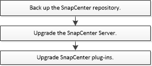

= Actualizar el flujo de trabajo
:allow-uri-read: 
:icons: font
:imagesdir: ../media/

[role="lead"]
Cada versión de SnapCenter contiene un servidor SnapCenter y un paquete de plugins actualizados. Las actualizaciones del paquete de plugins se distribuyen con el instalador de SnapCenter. Puede configurar SnapCenter para comprobar si hay actualizaciones disponibles.

El flujo de trabajo muestra las diferentes tareas necesarias para actualizar SnapCenter Server y los paquetes de plugins.

== Rutas de actualización admitidas

|===
| Si se encuentra en la versión de SnapCenter Server... | Puede actualizar directamente el servidor de SnapCenter a... | Versiones de plugins compatibles 

.2+| 4.3.x. | 4.4.x.  a| 
* 4.3.x.
* 4.4.x.

| 4.5.x.  a| 
* 4.5.x.

.2+| 4.4.x. | 4.5.x.  a| 
* 4.4.x.
* 4.5.x.

| 4.6.x.  a| 
* 4.6.x.

 a| 
4.5.x.
 a| 
4.6.x.
 a| 
* 4.5.x.
* 4.6.x.

|===

IMPORTANT: Por ejemplo, si utiliza SnapCenter versión 4.3.x y desea actualizar a 4.6.x, primero debe actualizar a 4.5.x y, a continuación, realizar una actualización a 4.6.x.

NOTE: Para obtener información sobre cómo actualizar el plugin de SnapCenter para VMware vSphere, consulte https://docs.netapp.com/us-en/sc-plugin-vmware-vsphere/scpivs44_upgrade.html["Actualice el plugin de SnapCenter para VMware vSphere"^].
